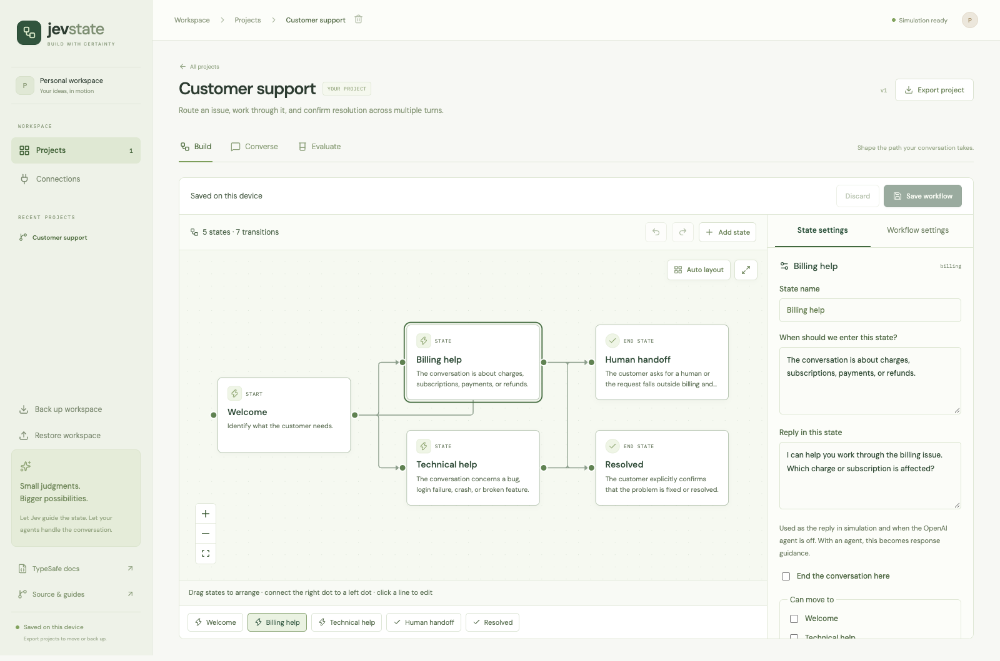
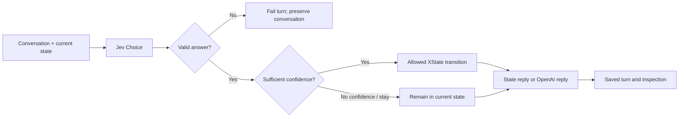
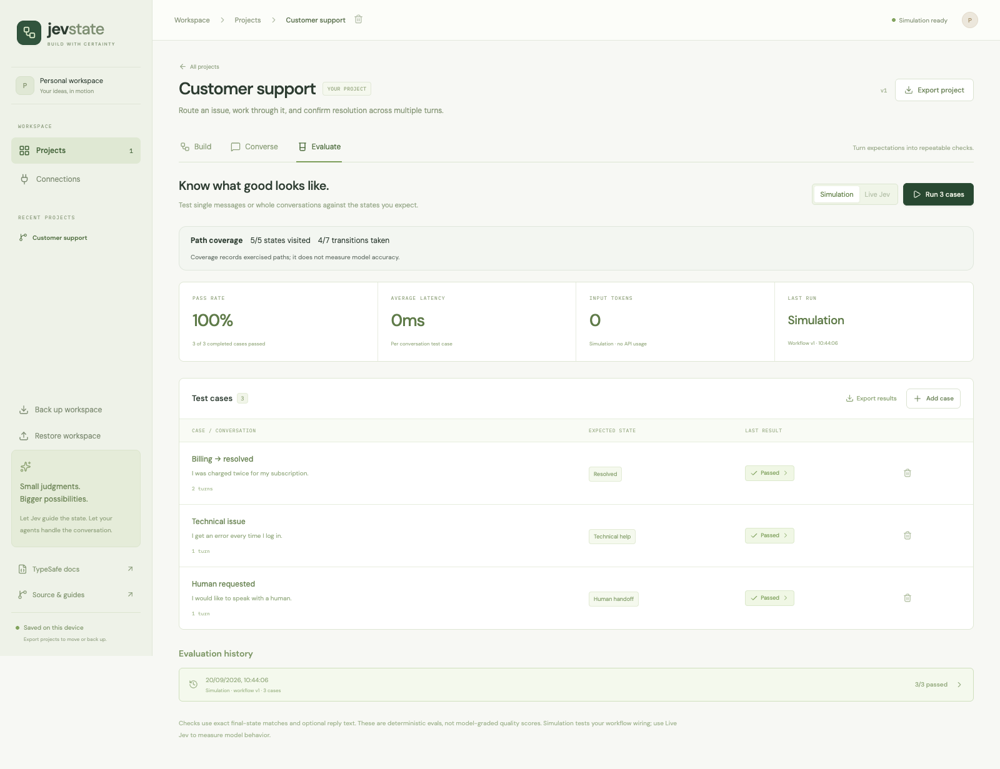

# Jev State

**Design, debug, and evaluate conversational state machines powered by Jev.**

[](https://github.com/priyankark/jev-state/actions/workflows/ci.yml)
[](LICENSE)
[](package.json)

[Try the studio](https://jev-state.vercel.app) · [Five-minute walkthrough](docs/TUTORIAL.md) · [Runtime & API](docs/DEVELOPMENT.md) · [Self-host](docs/SELF_HOSTING.md) · [Contribute](CONTRIBUTING.md)

Jev State is a visual workbench for developers building AI workflows. Draw the allowed paths, describe when each state applies, then try a conversation and inspect every decision. Turn successful and failing conversations into repeatable evaluation cases.

**MIT licensed. No account, subscription, project paywall, or database required.** Your workspace is saved in your browser. Live model usage is billed separately by your model providers.



## Why Jev State?

An AI conversation needs more than a prompt: it needs explicit states, allowed transitions, a policy for uncertainty, and evidence that it behaves as intended.

- **Build visually.** Drag states, connect handles, inspect edges, auto-layout, expand the canvas, and undo changes. A state list provides another way to navigate the graph.
- **Keep control in code.** Jev proposes a typed next-state choice. Validation, your confidence threshold, and the declared XState transitions determine whether it moves.
- **Test real conversations.** Each turn includes the conversation history. Use state-specific replies or optionally generate replies through OpenAI's Responses API.
- **Understand decisions.** Inspect the actual input, question, probabilities, threshold decision, resolved model, latency, and token usage.
- **Evaluate repeatably.** Run multi-turn cases with expected final states and reply assertions in the studio or from the command line. Inspect failures and path coverage.
- **Keep your work portable.** Export individual projects or back up and restore an entire workspace, including conversations and reports.

This project **uses XState**; it is an opinionated studio for Jev workflows, not an implementation of all XState features. Current workflows are flat state machines. Nested states, parallel regions, arbitrary executable guards, and XState machine import are not supported.

## Quickstart

Requires **Node.js 22** and npm. No provider account is needed for simulation.

```sh
git clone https://github.com/priyankark/jev-state.git
cd jev-state
npm ci
cp .env.example .env.local
npm run dev
```

Open **[localhost:5173](http://localhost:5173)**.

1. Choose **Use this example** on the support workflow and create your editable copy.
2. In **Build**, select a state to edit its entry criteria, reply, keywords, and outgoing transitions.
3. Open **Converse**, leave **Simulation** selected, and send `I was charged twice`.
4. Send `It is fixed now` to reach the end state.
5. Open **Evaluate** and run the three included cases. Click a result to inspect its turns.

**The home-screen workflows are examples, not pre-existing projects.** Copying a template creates your own project. You can also start with a blank workflow or import one of the [example JSON files](examples/workflows).

## Simulation and live models

| Mode                         | Routing                                                                | Replies                                                | Provider requests   |
| ---------------------------- | ---------------------------------------------------------------------- | ------------------------------------------------------ | ------------------- |
| Simulation                   | First matching destination keyword in transition order; otherwise stay | State reply text                                       | None                |
| Live Jev                     | TypeSafe Choice over allowed destinations plus `stay`                  | State reply text                                       | TypeSafe            |
| Live Jev + generated replies | Same Jev routing                                                       | OpenAI Responses using the history and resulting state | TypeSafe and OpenAI |

Simulation is deterministic and useful for testing the wiring. Its confidence values are fixtures, **not estimates of model accuracy**. Simulation requests still go to the installation's server; on the public demo, that is the hosted server. The [public studio](https://jev-state.vercel.app) starts in simulation and also supports your own provider keys.

On the hosted studio, open **Connections → Connect Jev**, paste your TypeSafe API key, and accept the provider-usage notice. Verification checks account access without generating a reply. Then explicitly choose **Live Jev** in Converse or Evaluate. Add an OpenAI key in Connections only if you want generated replies.

Personal keys stay in **this tab’s memory**. Reloading, closing the tab, or choosing **Disconnect and forget keys** clears them. They are never saved in localStorage, sessionStorage, cookies, exports, or a server database. Checks and live requests send keys through the same-origin server to the relevant provider; trust that installation's operator or run your own copy. Keys are not sent with simulation requests. Live usage is billed to the connected provider account. No Upstash, hosted key store, or subscription is needed.

For local development or CLI live decisions, put your key in the ignored `.env.local` file:

```dotenv
TYPESAFE_API_KEY=your-typesafe-key
TYPESAFE_DEFAULT_MODEL=jev-latest
```

Restart the server, open **Connections**, and test Jev. Then choose **Live Jev** in a conversation or evaluation. To verify from the terminal:

```sh
npm run check:env  # authenticate and list available models
npm run smoke:jev  # one small inference request; consumes provider usage
```

Optional generated replies need `OPENAI_API_KEY` in the same server environment. In **Build → Workflow settings**, enable generated replies and choose the model and instructions. The model must be available to your OpenAI account. The connector calls the Responses API with `store: false`; it does not run tools, remote Agents SDK services, or MCP connectors.

Provider credentials never belong in `VITE_*` variables, project JSON, workflow instructions, screenshots, or browser storage. On Vercel, operator-supplied server keys require `STUDIO_ACCESS_TOKEN`. Personal keys can be enabled separately with `STUDIO_BYOK=1`; `STUDIO_PUBLIC_DEMO=1` disables all live calls. See [deployment and configuration](docs/SELF_HOSTING.md).

## How a turn works



Each outgoing destination contributes its label and description as a Choice criterion. Jev sees the full conversation and workflow instructions. A `stay` option handles ambiguity and missing information. The runtime validates the returned choice and distribution before applying a transition; malformed provider output fails the turn instead of advancing it.

The transition passes when `confidence >= threshold`. Below the threshold, the machine stays in place and replies from the current state. Confidence describes how concentrated a Choice distribution is; it is not proof that the workflow decision is correct. Tune thresholds against representative examples. See TypeSafe's [Choice](https://docs.typesafe.ai/primitives/choice) and [confidence](https://docs.typesafe.ai/confidence) documentation.

An end state finishes the conversation after its reply. The studio never issues refunds, sends messages to third parties, or executes external actions because a state was selected.

## Evaluations in the studio and CI

A case contains one to five user messages, an expected final state, and an optional case-insensitive substring that must appear in the final reply. The runtime inserts each assistant response into the history before the next user message. Each case starts from the initial state with fresh history.

The studio shows pass rate, latency, usage, result details, and the states/transitions exercised. Editing workflow behavior or cases marks old reports as stale. Moving nodes does not change the workflow version or invalidate active conversations.

Run the same evaluation engine without a browser:

```sh
# Validate a workflow and print advisory graph diagnostics.
npm run evaluate -- --project examples/workflows/example-support.json --validate

# Run deterministic cases and write a machine-readable report.
npm run evaluate -- --project examples/workflows/example-support.json --out report.json

# Opt into real Jev inference and provider usage.
npm run evaluate -- --project examples/workflows/example-support.json --mode live --out live-report.json
```

Use your own **Export project** file in place of the example. Exit codes are `0` for all cases passing, `1` for failed expectations, and `2` for invalid input, an empty suite, or execution errors. Diagnostics are advisory, not validation failures. Use `npm run --silent evaluate -- ...` if you need JSON-only stdout. Reports include transcripts: keep private reports out of public commits.

CI can run a simulation suite with no secrets:

```yaml
- run: npm ci
- run: npm run evaluate -- --project examples/workflows/example-support.json --out report.json
```



**Path coverage is not accuracy.** A passing small example suite does not establish performance on your domain. Add ambiguous, adversarial, no-match, recovery, and multi-turn cases. A case that sends another message after reaching an end state is an execution error rather than a silent pass.

## Using the runtime from TypeScript

The repository contains two related surfaces:

| Surface                               | Purpose                                                                  | Example                                                               |
| ------------------------------------- | ------------------------------------------------------------------------ | --------------------------------------------------------------------- |
| Studio project schema + `executeTurn` | Editable, multi-turn conversation workflows                              | [JSON examples](examples/workflows), [API guide](docs/DEVELOPMENT.md) |
| `defineDecision` + `defineMachine`    | Typed, code-authored single-decision actors with Choice, Noul, and Score | [Support routing](examples/support-routing/machine.ts)                |

```sh
npm run example
# idle → evaluating → billing, followed by the policy result
```

The code-first example batches multiple judgments in one Jev request and applies an ordinary TypeScript policy. Its XState actor supports cancellation and ignores stale provider results. See [the runtime guide](docs/DEVELOPMENT.md#code-first-runtime) for server-side Jev wiring.

`@jev-state/core` and `@jev-state/typesafe` are currently **private npm workspaces in this repository**, not published npm packages. Clone the repository to use these examples; do not expect `npm install @jev-state/core` to work.

## Storage, editing, and limits

- Projects, conversations, and reports are stored in browser `localStorage`, scoped to the site's origin. There is no account sync or server database.
- Workflow edits require **Save workflow**; switching to Converse or Evaluate saves valid edits. Undo/redo applies to the current editing session. `⌘/Ctrl+S` saves; `⌘/Ctrl+Z` and `⌘/Ctrl+Shift+Z` undo/redo outside text inputs.
- **Back up workspace** exports saved projects, conversations, and reports. **Restore workspace** validates the file and replaces this device's workspace after confirmation. A project import instead creates a new copy without history.
- Corrupt stored data is preserved for recovery. Storage failures are visible. Changes from another tab pause saving until you back up/reload, avoiding silent overwrites.
- The studio retains the latest **60 conversations and 40 evaluation reports** across the workspace. Export important runs before they age out. There is no automatic remote backup.
- Current bounds: **2–12 states**, **20 conversation turns**, **30 cases per project**, **1–5 turns per case**, **500 KB project imports**, and **10 MB workspace imports**. Browser storage capacity may be lower than the import limit.
- Server requests have a **192 KB** JSON limit and a **50-second** execution deadline. Large histories can hit the request limit before the turn limit. Evaluation cases run sequentially; stopping preserves completed cases.

## Development and testing

```sh
npm run build                         # strict TypeScript checks + production build
npm test                              # runtime, schema, API, connector and CLI tests
npx playwright install chrome         # first-time browser setup
npm run test:e2e                       # real Chrome interactions, desktop and mobile viewport
```

The default tests do not call paid model services. Connector tests exercise SDK requests against controlled HTTP responses. Browser tests drag nodes and connect handles, save/reload, undo, inspect conversations, run evaluations, restore backups, and test storage failures, keyboard focus, personal-key isolation, reload/disconnect, and credential-free exports.

The live checks are explicit opt-ins. An actual Jev run and a mocked OpenAI contract test cover different things; the latter does not verify account access or model response quality. See [validation notes](docs/UX_REVIEW.md).

```text
apps/studio/                 React application and React Flow canvas
packages/core/src/           Schemas, graph diagnostics, backup validation, typed actors
packages/typesafe/src/       Server-only TypeSafe adapter
server/                     Express API, turn/evaluation engine, provider connections
api/index.ts                Vercel serverless entrypoint
examples/                   Importable projects and runnable TypeScript example
scripts/evaluate.ts          Evaluation/validation CLI
tests/                      Unit/API tests and Playwright browser coverage
docs/                       Tutorials, architecture, deployment, validation notes
```

The original single-decision inspector remains at `/legacy` on the local server. It demonstrates typed judgments, SSE traces, replay, and cancellation; its process-local trace API is not deployed to Vercel.

## Roadmap and contributing

Useful next steps include per-edge criteria, richer assertions and dataset comparison, IndexedDB storage, a published runtime package, nested statecharts, and explicit tool/agent adapters. These are **future work**, not current capabilities. See [the roadmap](PLAN.md), [contribution guide](CONTRIBUTING.md), and [security policy](SECURITY.md).

Built with [TypeSafe](https://docs.typesafe.ai), [XState](https://github.com/statelyai/xstate), [React Flow](https://github.com/xyflow/xyflow), React, TypeScript, and Zod. This is an independent community project, not an official TypeSafe or Stately product.

## License

[MIT](LICENSE). Use, modify, and self-host it. External model services have their own pricing and terms.
